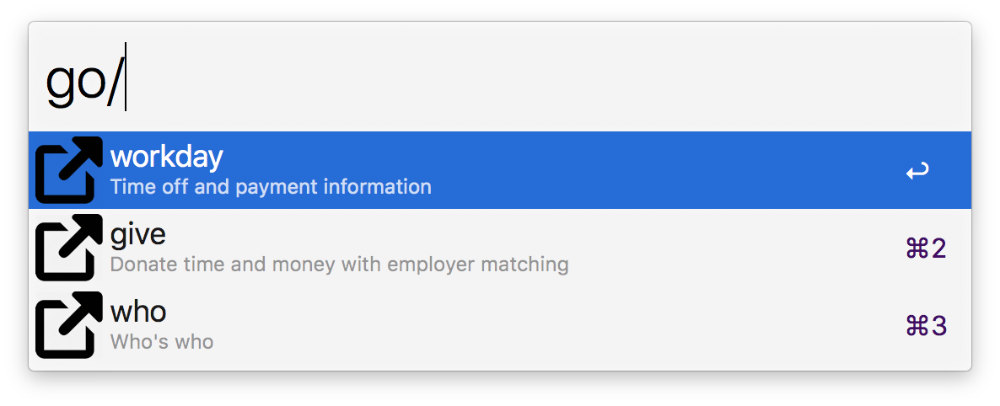
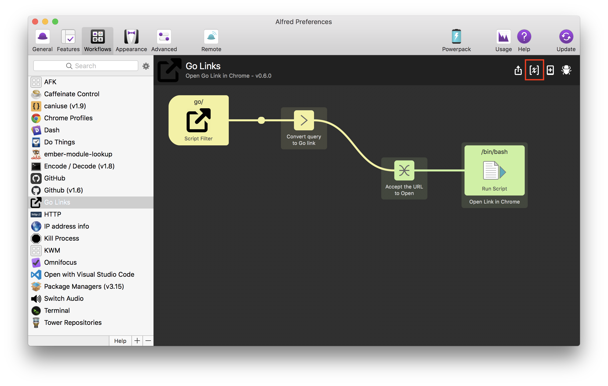
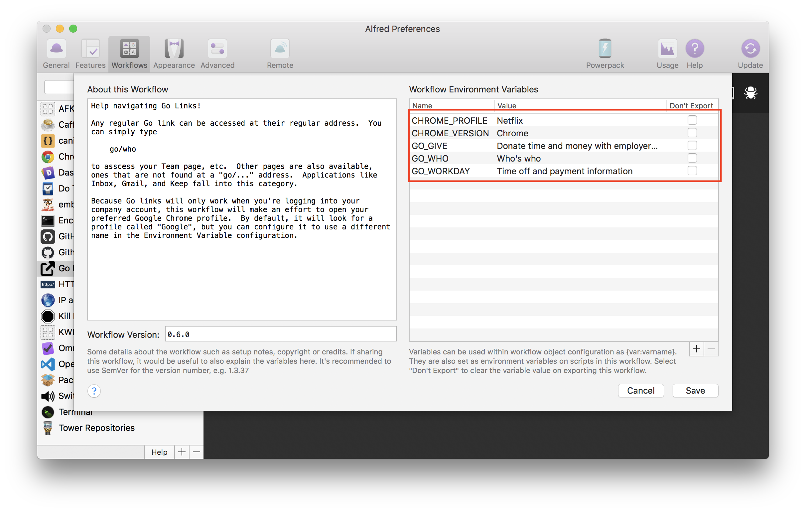

# alfred-go-links

> Quick access to `go/` links



Many companies, like Google and Netflix, use "go links" as shortcuts to commonly-used URLs.  They look something like

```txt
go/give
```

It can be hard to remember all of them, and since they're not normal URLs, Alfred doesn't know how to open them by default. So, I built a workflow to help out.

This workflow handles three main concerns:

- Opening links in a particular profile in Chrome (necessary when you have to be authenticated to view the links)
- Bookmarking popular links
- Opening links that are not bookmarked

# Installation

You should be able to download a pre-built version of the Alfred workflow from the latest release [here](https://github.com/alexlafroscia/alfred-go-links/releases/latest).

Once installed into Alfred, you'll need to do a little configuration.

First, open up the Environment settings for the workflow



Then, set the name of the Chrome profile you want to open (the default being `Netflix`).



Below that you'll see three entries for links that I have configured. You can add as many as you'd like, or remove the existing ones. The format is always

```
GO_LINK : The description of the link, which will appear in the Alfred result
```

which would create `go/link` as a suggestion for you when you type `go/` in Alfred

# Usage

Simply type `go/whatever` into Alfred and :boom: you're there

# Configuration

All of these options are to be set in the "Workflow Variables" configuration for the workflow

## `CHROME_PROFILE`

The profile to open in Chrome. This is useful for companies like Google where you'll likely have a "work" and "personal" profile, logged into different Google accounts. You need to open the `go/` links in the "work" profile or else they would not be logged in correctly.

## `CHROME_VERSION`

If you have a different version of Chrome that you want to open the links in, say Canary, you could set this to `Chrome Canary`. You probably don't need to override this.

## `GO_STUFF`

You can add as many entries for this as you'd like. Each will become a `go/` link suggested to you when using the workflow.
